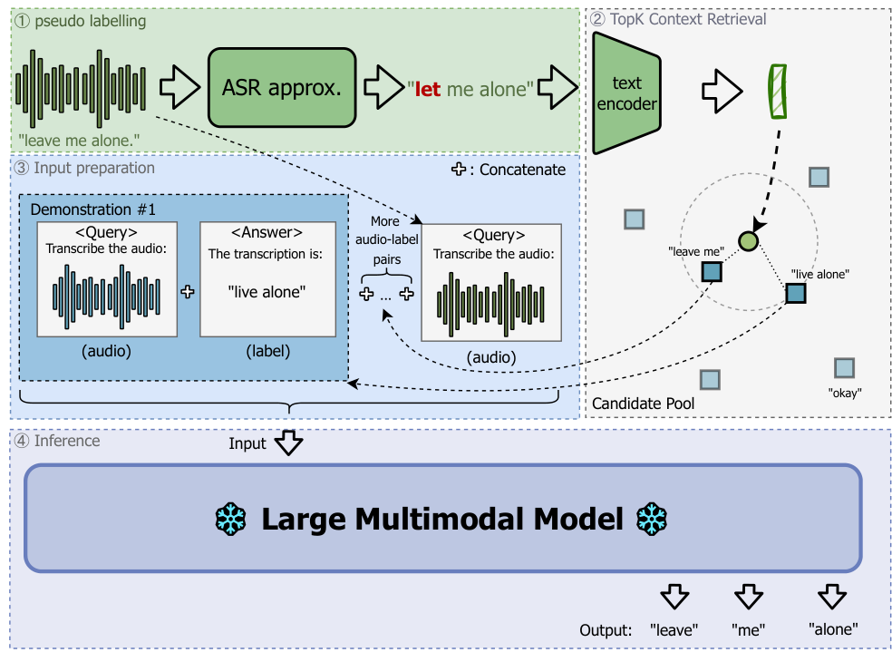
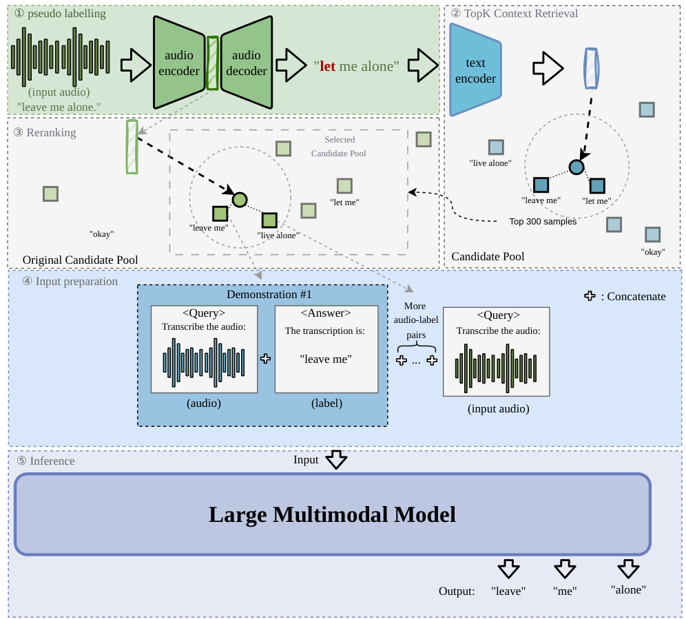

<h1 align="center">🧊 SICL-Retriever</h1>

<p align="center">
  Lightweight retrieval and data-preparation utilities for Speech In-Context Learning.
</p>

<p align="center">
  <a href="https://arxiv.org/abs/2509.13395">📄 TICL paper</a> ·
  <a href="https://arxiv.org/abs/2512.18263">📄 TICL+ paper</a> ·
  <a href="docs/citations.md">📚 BibTeX</a> ·
  <a href="examples/cv_en/README.md">🎧 CV-en demo</a>
</p>

`SICL-Retriever` prepares manifests with retrieved in-context examples. It currently implements the retrieval pipelines from TICL and TICL+, while staying intentionally prep-only: it does not run large multimodal model inference, WER evaluation, or paper table aggregation.

## 📄 Papers

<table>
  <tr>
    <td width="50%">
      <h3>🔎 TICL</h3>
      <p><strong>Text-Embedding KNN For Speech In-Context Learning Unlocks Speech Recognition Abilities of Large Multimodal Models</strong></p>
      <p>Semantic retrieval with pseudo-transcripts and text embeddings. Accepted to ICASSP 2026.</p>
      <p><a href="https://arxiv.org/abs/2509.13395">Paper</a> · <a href="assets/TICL.pdf">PDF graph</a> · <a href="docs/citations.md#ticl">BibTeX</a></p>
    </td>
    <td width="50%">
      <h3>🎧 TICL+</h3>
      <p><strong>A Case Study On Speech In-Context Learning for Children's Speech Recognition</strong></p>
      <p>Semantic retrieval followed by acoustic reranking for children's speech recognition.</p>
      <p><a href="https://arxiv.org/abs/2512.18263">Paper</a> · <a href="assets/TICL+.pdf">PDF graph</a> · <a href="docs/citations.md#ticl-1">BibTeX</a></p>
    </td>
  </tr>
</table>

## 🗺️ Pipeline Graphs

<table>
  <tr>
    <th>🔎 TICL</th>
    <th>🎧 TICL+</th>
  </tr>
  <tr>
    <td><a href="assets/TICL.pdf"></a></td>
    <td><a href="assets/TICL+.pdf"></a></td>
  </tr>
</table>

## ⚙️ Methods

TICL uses a pseudo-transcript of the query audio, embeds that text, and retrieves semantically similar labeled speech examples from a candidate pool.

TICL+ first performs TICL semantic retrieval, then reranks the candidate set by acoustic similarity using audio embeddings. This is useful when lexical content alone is not enough, especially for high-variability speech such as children's speech.

## 📦 Install

Retrieval-only install:

```sh
pip install -e .
```

Full prep install with model/audio dependencies:

```sh
pip install -e '.[prep]'
```

`faiss-cpu` is optional at runtime. If FAISS is unavailable, retrieval falls back to a NumPy exact-search implementation for small/debug runs.

## 🚀 Retrieval

```sh
sicl-retriever retrieve \
  --method ticl \
  --input-meta test.jsonl \
  --output-meta test_w_ice.jsonl \
  --candidate-meta pool.jsonl \
  --candidate-text-embeddings pool_text.npy \
  --test-text-embeddings test_text.npy \
  --topk 5 \
  --include-ids \
  --include-scores \
  --include-config
```

TICL+ adds audio embeddings:

```sh
sicl-retriever retrieve \
  --method ticl-plus \
  --input-meta test.jsonl \
  --output-meta test_w_ice.jsonl \
  --candidate-meta pool.jsonl \
  --candidate-text-embeddings pool_text.npy \
  --test-text-embeddings test_text.npy \
  --candidate-audio-embeddings pool_audio.npy \
  --test-audio-embeddings test_audio.npy \
  --topk 5
```

Legacy MetaSICL flags such as `--path_to_candidate_text_embedding` and `--path_to_candidate_text_embeddings` are accepted as aliases.

## 🎛️ Presets

Presets set paper-oriented defaults without hardcoding dataset paths:

```sh
sicl-retriever retrieve --preset multilingual ...
sicl-retriever retrieve --preset children --method ticl-plus ...
```

Available presets are `english`, `multilingual`, and `children`.

## ✅ Validation

```sh
sicl-retriever validate \
  --input-meta test.jsonl \
  --candidate-meta pool.jsonl \
  --candidate-text-embeddings pool_text.npy \
  --test-text-embeddings test_text.npy

sicl-retriever summarize --input-meta test_w_ice.jsonl
```

`validate` checks manifest schema, path existence, embedding row counts, and duplicate/overlap signals. `summarize` reports how many examples were attached per query.

## 🧪 Minimal Examples

The `examples/minimal` directory contains synthetic manifests and toy embeddings:

```sh
sicl-retriever retrieve \
  --method ticl \
  --input-meta examples/minimal/test.jsonl \
  --candidate-meta examples/minimal/candidates.jsonl \
  --output-meta /tmp/ticl_example.jsonl \
  --candidate-text-embeddings examples/minimal/candidate_text.npy \
  --test-text-embeddings examples/minimal/test_text.npy \
  --topk 2 \
  --include-ids

sicl-retriever retrieve \
  --method ticl-plus \
  --input-meta examples/minimal/test.jsonl \
  --candidate-meta examples/minimal/candidates.jsonl \
  --output-meta /tmp/ticl_plus_example.jsonl \
  --candidate-text-embeddings examples/minimal/candidate_text.npy \
  --test-text-embeddings examples/minimal/test_text.npy \
  --candidate-audio-embeddings examples/minimal/candidate_audio.npy \
  --test-audio-embeddings examples/minimal/test_audio.npy \
  --topk 2 \
  --include-ids
```

The `.wav` files in the example directory are placeholders for retrieval-only smoke tests. Model-based prep commands require real audio files.

`examples/cv_en` contains a tiny real-audio Common Voice English demo built from one prepared TICL row. It uses only `audio` and `text` fields, with the query audio from that row, the first three retrieved candidate audios, and one deterministic distractor from CV-en `validated.jsonl`. Review the example README before public redistribution because it contains real Common Voice voice clips.

## 🏗️ Full Prep Pipeline

```sh
sicl-retriever prepare \
  --method ticl-plus \
  --input-meta test.jsonl \
  --candidate-meta pool.jsonl \
  --output-meta test_w_ice.jsonl \
  --work-dir cache/sicl_retriever \
  --topk 5 \
  --device cuda
```

The pipeline skips existing intermediate artifacts unless `--overwrite` is set.

## 🐍 Python API

```python
import numpy as np
from sicl_retriever import TICLRetriever

candidate_text = np.load("pool_text.npy")
test_text = np.load("test_text.npy")
scores, ids = TICLRetriever(candidate_text).retrieve(test_text, topk=6)
```

## 📚 Citation

See [docs/citations.md](docs/citations.md) and [CITATION.cff](CITATION.cff).

## 🧰 Test

```sh
PYTHONPATH=src python -m unittest discover -s tests
```
